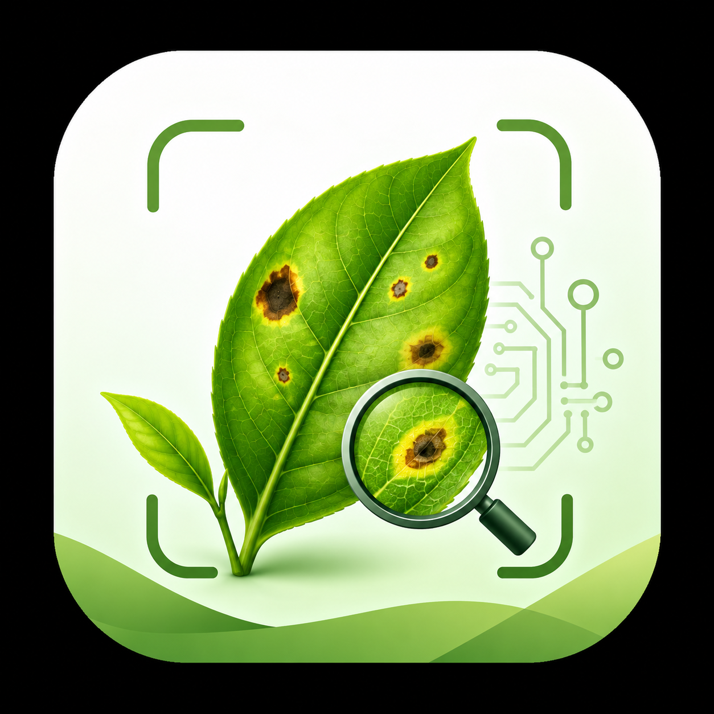
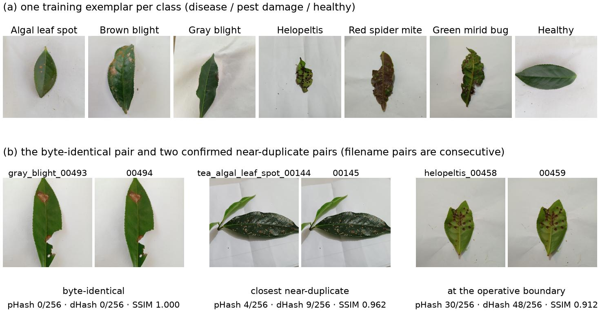
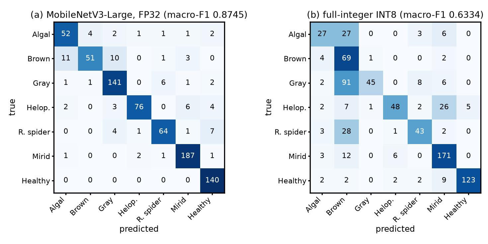
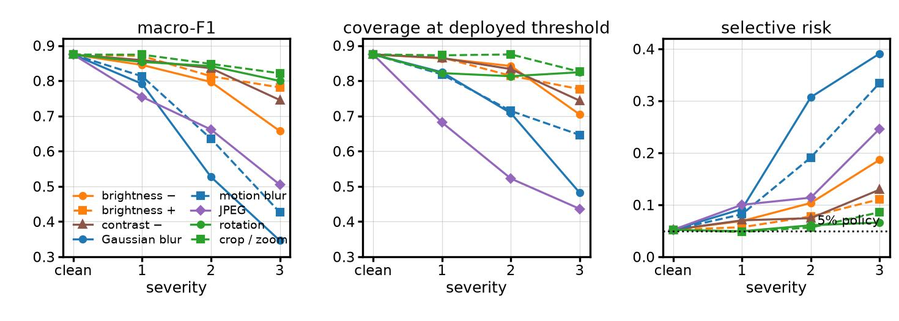
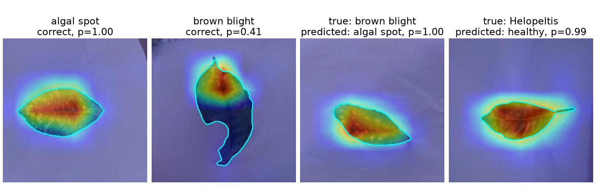

# teaLeaf

<p align="center">
  
</p>

<p align="center">
  <strong>Klasifikasi kondisi daun teh secara offline dengan TensorFlow/LiteRT dan Android.</strong>
</p>

TeaLeaf AI adalah artefak riset end-to-end untuk mengaudit dataset, melatih dan
mengevaluasi model klasifikasi tujuh kelas, mengekspor model ke TensorFlow Lite,
serta menjalankan inferensi langsung di perangkat Android. Model yang dipasang pada
aplikasi adalah MobileNetV3-Large FP16 dengan Class Activation Mapping (CAM),
kalibrasi probabilitas, dan mekanisme abstention untuk menolak prediksi yang kurang
meyakinkan.

> **Batas penggunaan:** aplikasi ini adalah alat bantu screening riset, bukan diagnosis
> ahli dan bukan pemberi rekomendasi pestisida atau perawatan. Dataset berisi daun yang
> dilepas dan dipotret pada latar relatif seragam; hasil belum membuktikan performa pada
> kondisi kebun nyata.

## Ringkasan utama

| Komponen | Implementasi |
|---|---|
| Dataset | teaLeafBD v3, 5.276 gambar, 7 kelas |
| Split utama | 3.694 train / 791 validation / 791 test, duplicate-group aware |
| Eksperimen | 5 backbone × 3 seed (`42`, `123`, `2026`) |
| Model aplikasi | MobileNetV3-Large FP16 + CAM, input RGB `224×224` |
| Test model aplikasi | macro-F1 **87,45%**, accuracy **89,89%** |
| Abstention | coverage **87,48%**, selective accuracy **94,80%** |
| Latensi perangkat | median **14,019 ms**, p95 **14,942 ms** untuk FP16-CAM |
| Privasi runtime | inferensi lokal; aplikasi tidak meminta izin Internet |

Tidak diperlukan layanan cloud, API key, atau file `.env` untuk membangun dan
menjalankan aplikasi Android.

## Alur proyek

1. Memverifikasi provenance, checksum, versi, label, dan lisensi dataset.
2. Mendeteksi gambar identik/near-duplicate dan menempatkan seluruh anggota grup pada
   partisi yang sama.
3. Melatih lima backbone dengan tiga seed pada protokol yang sama.
4. Mengukur accuracy, macro-F1, kalibrasi, abstention, dan robustness.
5. Mengekspor FP32, FP16, dynamic-range INT8, dan full-integer INT8 lalu menguji parity.
6. Menanamkan model FP16-CAM pada aplikasi Android offline.
7. Memeriksa latensi, parity desktop–Android, dan lokasi evidensi CAM.

Artefak hasil yang menjadi sumber angka di README ini tersedia di
[`reports/frozen_results.json`](reports/frozen_results.json),
[`tables/`](tables/), dan [`reports/device_benchmark/`](reports/device_benchmark/).

## Dataset dan kelas



<p align="center"><em>Gambar 1. Contoh satu gambar untuk setiap kelas serta pasangan identik dan near-duplicate yang ditemukan saat audit. Gambar turunan dari teaLeafBD v3, CC BY 4.0; anotasi dan tata letak ditambahkan oleh proyek ini.</em></p>

| # | Label model | Tampilan Bahasa Indonesia |
|---:|---|---|
| 1 | Tea algal leaf spot | Bercak daun alga |
| 2 | Brown blight | Hawar coklat |
| 3 | Gray blight | Hawar kelabu |
| 4 | Helopeltis damage | Kerusakan Helopeltis |
| 5 | Red spider mite damage | Kerusakan tungau merah |
| 6 | Green mirid bug damage | Kerusakan kepik hijau |
| 7 | Healthy leaf | Daun sehat |

Split utama menggunakan seed 42 dan menahan seluruh duplicate group di satu partisi.
Sebanyak 5.276 gambar dibagi menjadi 70,02% train, 14,99% validation, dan 14,99%
test. Dua belas pengujian otomatis memeriksa agar digest, grup, dan pasangan duplikat
tidak menyeberangi partisi. Rincian tersedia di
[`data/splits/split_summary.json`](data/splits/split_summary.json) dan
[`reports/G3_split_audit.md`](reports/G3_split_audit.md).

Dataset asli tidak didistribusikan ulang. Unduh teaLeafBD v3 dari
[Mendeley Data](https://data.mendeley.com/datasets/744vznw5k2/3), lalu cocokkan dengan
manifest dan checksum yang tersedia di repository. Lihat
[`LICENSES/DATASET_LICENSE.txt`](LICENSES/DATASET_LICENSE.txt) untuk atribusi dan
catatan lisensi lengkap.

## Hasil benchmark model

Nilai berikut adalah rata-rata test set dari tiga seed pada split utama.

| Backbone | Parameter | Macro-F1 mean ± SD | Accuracy mean |
|---|---:|---:|---:|
| **ConvNeXt-Tiny** | 27,826 juta | **90,21% ± 0,58%** | **91,87%** |
| EfficientNetV2-B0 | 5,928 juta | 87,50% ± 1,18% | 89,59% |
| MobileNetV3-Large | 3,003 juta | 86,09% ± 1,56% | 88,37% |
| MobileNetV3-Small | 0,943 juta | 85,69% ± 0,22% | 88,12% |
| EfficientNet-B0 | 4,059 juta | 84,05% ± 0,54% | 86,64% |

ConvNeXt-Tiny memberi skor rata-rata tertinggi. MobileNetV3-Large dipertahankan sebagai
model aplikasi karena jauh lebih kecil dan merupakan graph yang sudah diekspor,
diuji parity, diberi CAM, serta diukur pada perangkat. Keputusan deployment ini bukan
klaim bahwa MobileNetV3-Large adalah backbone paling akurat.

Sumber: [`tables/multiseed_table.csv`](tables/multiseed_table.csv) dan
[`tables/benchmark_table.csv`](tables/benchmark_table.csv).

### Model deployment pada test set

| Metrik MobileNetV3-Large, seed 42 | Nilai |
|---|---:|
| Macro-F1 | **87,45%** |
| Bootstrap 95% CI macro-F1 | 84,62–90,02% |
| Accuracy | **89,89%** |
| Balanced accuracy | 86,63% |
| Matthews correlation coefficient | 0,8791 |
| Jumlah parameter | 3.003.079 |



<p align="center"><em>Gambar 2. Confusion matrix pada 791 gambar test. FP32 mempertahankan macro-F1 0,8745, sedangkan full-integer INT8 turun menjadi 0,6334; kegagalan terbesar adalah Gray Blight yang berpindah ke Brown Blight.</em></p>

## Kalibrasi dan abstention

Temperature scaling dipasang hanya pada validation set lalu diterapkan tanpa tuning
ulang pada test set.

| Metrik test | Sebelum kalibrasi | Sesudah kalibrasi |
|---|---:|---:|
| Expected Calibration Error | 5,87% | **2,54%** |
| Negative log-likelihood | 0,3894 | **0,3054** |
| Accuracy | 89,89% | 89,89% |

Dengan temperature `1,7662` dan threshold `0,6985`, model menjawab 692 dari 791
gambar test:

| Coverage | Selective accuracy | Ditolak/abstain | Accuracy pada gambar ditolak |
|---:|---:|---:|---:|
| 87,48% | **94,80%** | 99 | 55,56% |

Selective risk pada test adalah 5,20%, sedikit di atas target 5% yang dipilih pada
validation. Mekanisme ini adalah confidence-based abstention, bukan detektor
out-of-distribution. Sumber lengkap:
[`tables/calibration/calibration.json`](tables/calibration/calibration.json).

## Export dan kuantisasi

| Varian | Ukuran | Macro-F1 | Top-1 agreement vs referensi | Keputusan |
|---|---:|---:|---:|---|
| FP32 | 11,928 MB | 87,45% | 100% | Referensi |
| **FP16** | 6,009 MB | **87,45%** | **100%** | Basis model aplikasi |
| Dynamic-range INT8 | 3,293 MB | 88,27% | 97,22% | Tidak berbeda signifikan dari referensi |
| Full-integer INT8 | 3,502 MB | 63,34% | 65,61% | Ditolak karena degradasi material |

Kenaikan dynamic-range INT8 sebesar 0,82 poin tidak boleh dibaca sebagai peningkatan
yang pasti karena bootstrap CI 95% untuk selisihnya adalah −0,46 hingga 2,15 poin.
Sebaliknya, full-integer INT8 kehilangan 24,11 poin macro-F1 dan tidak digunakan.
Detail tersedia di
[`tables/export/parity_analysis.json`](tables/export/parity_analysis.json) dan
[`models/exported/export_report.json`](models/exported/export_report.json).

## Robustness terhadap penurunan kualitas gambar



<p align="center"><em>Gambar 3. Perubahan macro-F1, coverage, dan selective risk saat severity dinaikkan. Blur dan kompresi JPEG paling merusak; crop/zoom relatif paling stabil.</em></p>

Penurunan macro-F1 pada severity 3 dibanding kondisi bersih:

| Korupsi | Penurunan macro-F1 |
|---|---:|
| Gaussian blur | **52,84 poin** |
| Motion blur | 44,82 poin |
| JPEG compression | 36,95 poin |
| Brightness down | 21,72 poin |
| Contrast down | 12,92 poin |
| Brightness up | 9,34 poin |
| Rotation | 7,49 poin |
| Crop/zoom | 5,33 poin |

Threshold dari kondisi bersih melampaui target risiko pada 22 dari 24 kondisi korupsi,
dan coverage turun di bawah 70% pada lima kondisi. Karena itu repository ini tidak
mengklaim robustness lapangan. Angka lengkap ada di
[`tables/robustness/robustness.json`](tables/robustness/robustness.json).

## Evidensi visual dengan CAM



<p align="center"><em>Gambar 4. Contoh CAM pada prediksi benar dan salah; garis cyan menandai mask daun. Gambar turunan dari teaLeafBD v3, CC BY 4.0; overlay dan tata letak ditambahkan oleh proyek ini.</em></p>

| Pemeriksaan CAM | Hasil |
|---|---:|
| Mask yang dapat digunakan | 764 / 791 |
| Median luas daun dalam frame | 11,61% |
| Median massa aktivasi pada daun | 58,61% |
| Median concentration ratio | **5,11×** |
| Peak CAM berada pada daun | **96,60%** |
| Accuracy gambar asli pada subset yang sama | 89,79% |
| Accuracy setelah background dihilangkan | 85,34% |
| Accuracy background-only | 18,19% |

Hasil ini menunjukkan bahwa evidensi model umumnya terkonsentrasi pada daun, tetapi
CAM hanya menunjukkan *di mana* aktivasi berada. CAM tidak membuktikan bahwa model
memahami penyebab biologis suatu lesi. Sumber:
[`tables/cam/cam_sanity.json`](tables/cam/cam_sanity.json).

## Aplikasi Android

Aplikasi berada di [`android/`](android/) dan dapat dibangun tanpa dataset atau proses
training karena model FP16-CAM beserta konfigurasi sudah tersedia di
[`android/app/src/main/assets/`](android/app/src/main/assets/).

Karakteristik runtime:

- Android minimum API 24, target API 36, ABI `arm64-v8a`.
- CameraX untuk capture dan Jetpack Compose untuk antarmuka.
- LiteRT dengan empat thread dan XNNPACK untuk inferensi.
- Input RGB float32 `224×224`; normalisasi berada di dalam graph.
- Output tujuh probabilitas, temperature scaling, abstention, dan heatmap CAM.
- Hanya izin kamera yang dideklarasikan; tidak ada izin Internet.

> **Catatan privasi lokal:** field logger saat ini masih bersifat eksperimental dan
> menyimpan JPEG serta JSONL setiap inferensi ke direktori khusus aplikasi. Implementasi
> belum menyediakan consent screen. Tinjau atau nonaktifkan `FieldLogger` sebelum
> penggunaan di luar eksperimen terkontrol, dan bersihkan storage aplikasi bila rekaman
> tidak lagi diperlukan.

Benchmark model `tealeaf_fp16_cam.tflite` pada perangkat referensi Android:

| Ukuran | Warm-up | Pengukuran | Median | P90 | P95 | Cold start |
|---:|---:|---:|---:|---:|---:|---:|
| 5,72 MiB | 30 | 3 × 200 | **14,019 ms** | 14,648 ms | 14,942 ms | 43,540 ms |

Angka hanya mengukur inferensi model dan tidak memasukkan decode, rotasi, atau resize
bitmap. Uji parity engineering pada delapan input identik menghasilkan 8/8 top-1 yang
sama antara Android dan desktop; deviasi probabilitas maksimum adalah `2,627 × 10⁻⁷`.
Lihat [`reports/device_benchmark/benchmark_report.json`](reports/device_benchmark/benchmark_report.json)
dan [`reports/device_benchmark/parity_comparison.json`](reports/device_benchmark/parity_comparison.json).

### Build Android

Prasyarat: JDK 17 atau lebih baru dan Android SDK 36. Wrapper proyek menggunakan
Gradle 8.14 dan Android Gradle Plugin 8.13.0.

Windows PowerShell:

```powershell
cd android
.\gradlew.bat testDebugUnitTest
.\gradlew.bat assembleDebug
```

Linux/macOS/WSL:

```bash
cd android
bash ./gradlew testDebugUnitTest
bash ./gradlew assembleDebug
```

APK debug dihasilkan pada `android/app/build/outputs/apk/debug/app-debug.apk`.
Release signing sengaja tidak disimpan di repository.

## Reproduksi pipeline machine learning

Training penuh ditujukan untuk WSL2/Linux dengan Python dan TensorFlow. Dependensi
terkunci tersedia di
[`environment/requirements-lock.txt`](environment/requirements-lock.txt).

```bash
# 1. Buat environment TensorFlow.
bash environment/setup_wsl_env.sh
source "$HOME/tea_ws/venv/bin/activate"

# 2. Ekstrak archive teaLeafBD v3 yang telah diunduh secara resmi.
bash src/data/extract_v3.sh /path/to/teaLeafBD.zip \
  "$HOME/tea_ws/data/raw/v3_extract"

# 3. Bangun cache dari split yang sudah dibekukan di repository.
python src/training/build_cache.py \
  --splits-dir data/splits \
  --image-root "$HOME/tea_ws/data/raw/v3_extract/teaLeafBD/teaLeafBD" \
  --outdir "$HOME/tea_ws/cache"

# 4. Contoh: latih ulang model deployment seed 42.
python src/training/train.py \
  --backbone mobilenetv3_large \
  --cache-dir "$HOME/tea_ws/cache" \
  --split-prefix primary \
  --outdir "$HOME/tea_ws/runs/mobilenetv3_large__primary__seed42" \
  --seed 42 --warmup-epochs 5 --finetune-epochs 35 \
  --patience 8 --batch-size 32 --mixed-precision
```

Beberapa helper shell/PowerShell menyimpan default path untuk workstation tempat
eksperimen dijalankan. Tinjau variabel `TEA_REPO`, lokasi cache, lokasi run, dan lokasi
dataset sebelum menjalankan pipeline penuh pada mesin lain. Dataset mentah, cache,
checkpoint training, serta material signing tidak disimpan dalam Git.

### Pengujian split

```bash
python -m pytest -q
```

Test suite saat ini berisi 12 pemeriksaan integritas split dan memastikan tidak ada
duplikat atau grup yang bocor antarpartisi.

## Struktur repository

| Path | Isi |
|---|---|
| `android/` | Aplikasi offline, model asset, unit test, dan instrumented test |
| `src/audit/` | Audit versi, checksum, kualitas, bias, dan duplikasi data |
| `src/data/` | Ekstraksi dataset dan pembuatan split |
| `src/training/` | Cache preprocessing dan training multi-backbone/multi-seed |
| `src/evaluation/` | Evaluasi, robustness, CAM, serta pembekuan hasil |
| `src/export/` | Export dan parity TensorFlow Lite |
| `src/benchmarking/` | Benchmark serta parity pada perangkat Android |
| `data/` | Manifest, checksum, audit, dan definisi split; bukan dataset mentah |
| `models/exported/` | Varian model TensorFlow Lite dan metadata export |
| `tables/` | Hasil numerik terstruktur dan prediction artifacts |
| `figures/` | Visualisasi dataset, confusion matrix, robustness, dan CAM |
| `reports/` | Audit dataset/split, hasil beku, dan benchmark perangkat |
| `tests/` | Pengujian integritas split |
| `environment/` | Setup dan lockfile environment eksperimen |
| `LICENSES/` | Atribusi serta catatan lisensi dataset |

## Lisensi dan atribusi

- teaLeafBD v3: DOI [`10.17632/744vznw5k2.3`](https://doi.org/10.17632/744vznw5k2.3),
  tercatat sebagai CC BY 4.0 pada Mendeley Data. Lihat catatan konflik metadata lisensi
  pada [`LICENSES/DATASET_LICENSE.txt`](LICENSES/DATASET_LICENSE.txt) sebelum melakukan
  redistribusi.
- Gambar dataset dalam README adalah karya turunan dari teaLeafBD v3 dan mengikuti
  persyaratan atribusi sumber tersebut.
- Repository belum memiliki lisensi kode tingkat-root. Jangan mengasumsikan izin untuk
  penggunaan ulang kode atau model di luar hak yang dinyatakan secara eksplisit.
